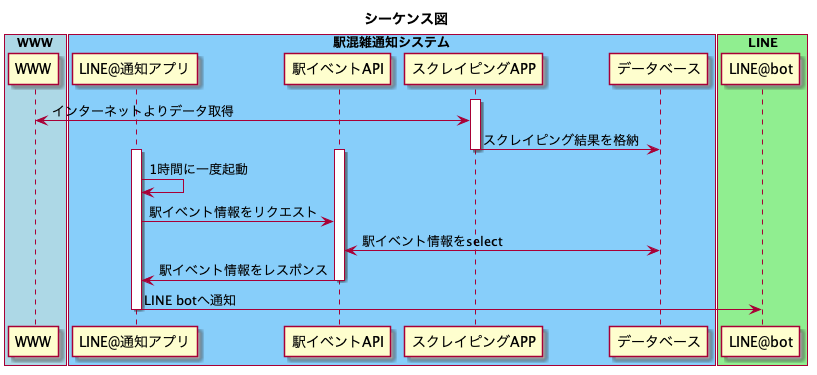

# station-congestion-forecast
# 概要
- 海浜幕張駅の周辺のイベント情報より、混雑予想を行いLINEで通知を行うシステム

# システムイメージ図

## Station congestion forecast API

## LINE@ APP
- https://developers.line.biz/ja/

## 使用したツール

### PlanetUML 
- http://plantuml.com/ja/sequence-diagram

